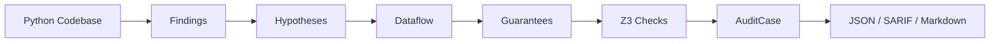
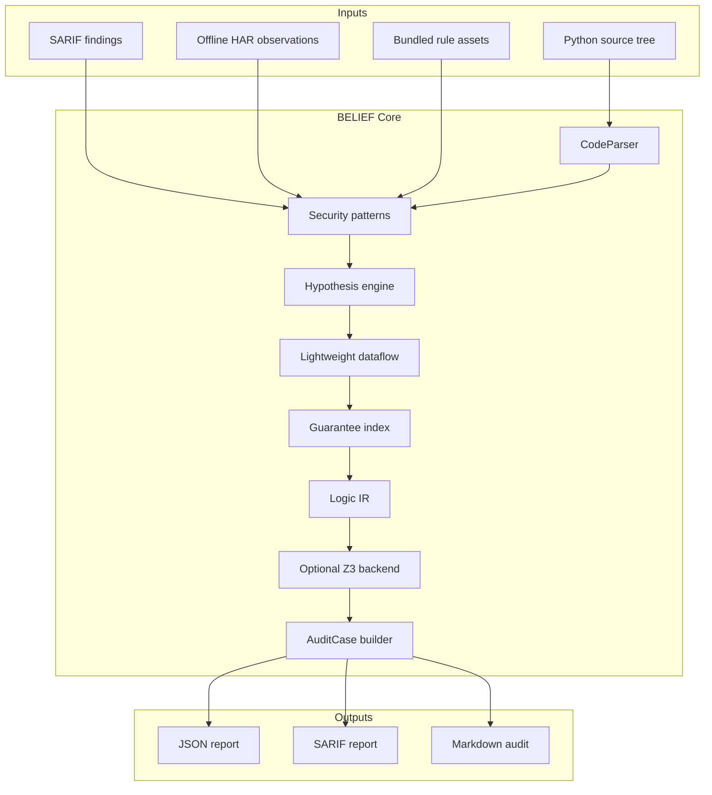

# BELIEF v4


BELIEF v4 is an experimental white-box security reasoning engine for Python code.

It is designed for local, authorized code review and research workflows where raw findings are not enough. BELIEF keeps a stable finding model, then adds hypothesis metadata, lightweight dataflow, mined guarantees, optional boolean Z3 checks, route context, and audit-oriented output formats.

BELIEF is not an exploit generator. It is a local reasoning and triage layer intended to help a human reviewer understand what is actionable, what is protected, what is likely noise, and what still needs manual validation.

---

## PDX JSON Adapter

BELIEF can passively import JSON-only PDX bundles as normalized tool results:

```bash
python -m belief pdx import tests/fixtures/pdx/pdx_bundle_sample.json \
  --normalized-output out/pdx.belief-tools.json
```

Those normalized results can then be fed into audit/reportability mode:

```bash
python -m belief scan ./app \
  --import-tool-results out/pdx.belief-tools.json \
  --reportability \
  --json-output out/audit.json
```

This adapter is deliberately offline and conservative. It does not import
binary PDX, HYDRA runtime code, UI, browser automation, gcloud sync, API engines,
personas, lures, or real sessions. See
[`docs/PDX_BELIEF_INTEGRATION.md`](docs/PDX_BELIEF_INTEGRATION.md).

---

## What It Does

BELIEF's current review path is:

```text
Finding -> Hypothesis -> Dataflow -> Guarantees -> Z3 -> AuditCase
```

The goal is to help a reviewer understand why a finding may be:

- actionable;
- protected by local guarantees;
- likely false-positive context;
- still in need of manual review.

In practical terms, BELIEF tries to answer questions like:

- What did the scanner find?
- What vulnerability hypothesis does this finding imply?
- Is there a source-to-sink dataflow?
- Does the code contain defensive guarantees?
- Can a simple logical contradiction prove that a hypothesis is protected?
- What should a human auditor review next?

---

## Pipeline



## Architecture At A Glance



---

## Core Concepts

### Finding

A `Finding` is a raw security signal found in the code.

Examples:

- dangerous function call;
- suspicious hardcoded value;
- unsafe deserialization pattern;
- possible path traversal sink;
- possible XSS sink.

A finding alone is not always a vulnerability. It is only the starting point.

### Hypothesis

A `Hypothesis` is BELIEF's interpretation of a finding.

Example:

```text
This open(path) call may be a path traversal risk.
```

or:

```text
This pickle.loads(...) call may be unsafe deserialization.
```

The hypothesis can later be strengthened, weakened, contradicted, or left unproven.

### Dataflow

Dataflow tries to connect where a value comes from to where it is used.

Example:

```text
request parameter -> variable -> function call -> dangerous sink
```

BELIEF currently uses lightweight source-to-sink reasoning. It is intentionally conservative and does not claim to be a complete interprocedural static analysis engine.

### Guarantees

A guarantee is evidence in the code that reduces or contradicts a vulnerability hypothesis.

Examples:

- authentication decorator;
- object ownership check;
- tenant scoping;
- path boundary validation;
- escaping function;
- server-generated filename;
- safe wrapper around file paths.

Guarantees are important because many static-analysis findings are not exploitable when the surrounding code proves that the risky condition cannot happen.

### Z3 Checks

BELIEF includes a minimal boolean logic layer that can use Z3 for narrow contradiction checks.

Example:

```text
Hypothesis: path may escape storage
Guarantee: path cannot escape storage
Result: contradiction
```

When a contradiction is proven, BELIEF can classify a case as protected instead of leaving it as a raw alert.

Z3 support is currently limited and intentionally scoped.

### AuditCase

An `AuditCase` is the review-oriented output.

It is meant for a human auditor.

An AuditCase may include:

- priority;
- status;
- source;
- sink;
- file and line;
- route context;
- dataflow summary;
- guarantees;
- missing guarantees;
- next manual validation steps.

---

## Features

- local Python code scanning;
- audit mode;
- stable `Finding` / `Hypothesis` / `AuditCase` model;
- lightweight source-to-sink dataflow;
- guarantee extraction;
- optional Z3 boolean contradiction checks;
- Flask / FastAPI / Django route inventory;
- `route_context` enrichment for `AuditCase`;
- JSON / SARIF / Markdown outputs;
- SARIF import skeleton for future bridge outputs;
- audit deduplication and clustering;
- centralized security taxonomy;
- optional bridge-oriented architecture for external tools.

---

## Tool Bridges

BELIEF can normalize outputs from external tools through local/passive bridges.
The bridge system is designed to avoid vendoring large third-party tools.

Supported bridge modes:

- passive import of existing JSON/SARIF outputs;
- external CLI execution for safe local tools;
- recipe export for manual validation workflows;
- dynamic execution only with explicit scope and safety flags.

Examples:

```bash
python -m belief tools list
python -m belief tools info semgrep
python -m belief tools check
python -m belief tools import semgrep --file out/semgrep.json
```

Dynamic or network-capable bridges are blocked by default. They require explicit
`--allow-dynamic`, `--allow-network`, and a `--scope-file` before execution.

The first bridge milestone includes manifests and MVP adapters for Semgrep,
CodeQL SARIF, ZAP JSON, Arjun JSON, OpenAPI/Schemathesis metadata,
AuthMatrix-like access observations, Autorize-style recipes, Param Miner
wordlists, Dradis Markdown, Faraday JSON, and simple threat-model export.

See `docs/TOOL_BRIDGES.md` for architecture and extension notes.

### Imported Tool Results and Reportability

BELIEF can persist bridge output as stable normalized JSON, import one or more
of those files during `scan`, convert the signals into audit cases, and attach
conservative reportability assessments.

```bash
python -m belief tools import semgrep \
  --file out/semgrep.json \
  --normalized-output out/semgrep.belief-tools.json

python -m belief scan ./app \
  --import-tool-results out/semgrep.belief-tools.json \
  --reportability \
  --json-output out/audit.json

python -m belief scan ./app \
  --import-tool-results out/semgrep.belief-tools.json \
  --reportability \
  --bug-bounty-markdown out/bug-bounty-candidates.md
```

Reportability output uses candidate language. Static/imported evidence is not a
confirmed vulnerability; the generated validation steps are a safe manual review
plan for authorized scope.

---

## Output Formats

BELIEF can produce multiple output formats.

### JSON

Useful for automation, debugging, and integration.

```bash
python -m belief scan path/to/python/project \
  --audit-mode \
  --json-output out/audit.json
```

### SARIF

Useful for security tooling interoperability.

```bash
python -m belief scan path/to/python/project \
  --audit-mode \
  --sarif-output out/audit.sarif
```

### Markdown

Useful for human-readable audit summaries.

```bash
python -m belief scan path/to/python/project \
  --audit-mode \
  --audit-markdown out/audit.md
```

---

## Example Usage

From the repository root:

```bash
python -m pip install -e ".[dev,z3]"
python -m belief --help
python -m belief scan --help
```

Example local scan:

```bash
python -m belief scan path/to/python/project \
  --audit-mode \
  --dataflow \
  --routes \
  --json-output out/audit.json
```

Example with SARIF and Markdown output:

```bash
python -m belief scan path/to/python/project \
  --audit-mode \
  --dataflow \
  --routes \
  --dedup-audit-cases \
  --json-output out/audit.json \
  --sarif-output out/audit.sarif \
  --audit-markdown out/audit.md
```

---

## Current Validation

BELIEF v4 has been tested locally on real-world and benchmark-style Python codebases to validate several behaviors:

- keeping unsafe deserialization findings visible when no strong guarantee is found;
- downgrading protected findings when local guarantees contradict the vulnerability hypothesis;
- reducing noisy false positives in generated SDK-style code;
- attaching route context to audit cases when static route extraction is possible.

Current local regression baseline:

- full suite: `317 passed, 31 skipped`;
- security suite: `44 passed`.

These numbers may change as the project evolves.

---

## Responsible Use

BELIEF is intended for:

- authorized code review;
- local auditing;
- security research;
- education;
- bug bounty work within program scope.

BELIEF is not an exploit generator.

BELIEF does not perform network attacks.

The public repository intentionally excludes active black-box network scanner
entrypoints. Offline HAR/session parsing remains available for local,
permissioned analysis without touching live third-party systems.

Any future bridge or scanner integration should remain local, authorized,
explicit, opt-in, and documented.

Do not use BELIEF against systems or codebases where you do not have permission to perform security review.

---

## Bundled Assets

This repository intentionally keeps:

- `belief/tools_bundled/`
- `belief/security_rules/`

These directories contain optional local assets, compatibility resources, rule packs, or bridge-support materials used by BELIEF during analysis and testing. They are kept for reproducibility and research transparency.

Some files in these directories may originate from third-party ecosystems or rule formats. Their provenance and licensing should be reviewed per subdirectory before commercial redistribution, repackaging, or relicensing.

The BELIEF core remains in:

```text
belief/
```

See `BUNDLED_ASSETS.md` for the current asset inventory and publication notes.

---

## Limitations

BELIEF v4 is still an experimental MVP.

Current limitations include:

- Python-focused analysis;
- conservative static analysis;
- no complete CFG engine;
- no complete alias analysis;
- limited interprocedural reasoning;
- Z3 support currently limited to narrow boolean contradiction checks;
- route extraction is static and heuristic;
- bundled assets require per-subdirectory provenance and license review;
- human validation is still required.

BELIEF should be treated as a triage and reasoning assistant, not as a fully automated vulnerability oracle.

---

## Roadmap

Planned directions include:

- stronger route-to-audit-case enrichment;
- better interprocedural caller reasoning;
- improved source/sink/sanitizer taxonomy;
- more robust SARIF import for external tools;
- optional bridges for Semgrep, CodeQL, Bandit, and other scanners;
- more real-world benchmark documentation;
- improved documentation and demo assets;
- cleaner public examples and tutorials.

---

## Tests

Run the default local suite:

```bash
python -m pytest -q
```

Run security-focused regressions:

```bash
python -m pytest -q -m security
```

Run CLI checks:

```bash
python -m belief --help
python -m belief scan --help
```

---

## Repository Structure

```text
belief/
  Core BELIEF package.

belief/tools_bundled/
  Optional bundled compatibility assets and local helper resources.

belief/security_rules/
  Bundled security rule assets and references.

belief/tools/
  Universal external-tool bridge registry, safety gate, runners, and adapters.

belief/tools_bundled/manifests/
  JSON manifests describing supported bridge IDs, capabilities, licenses, and risk profiles.

tests/
  Unit and regression tests.

tests_bridges/
  Bridge-related tests.

benchmark_cve/
  Benchmark-style vulnerable samples used for validation.

belief_knowledge_base.py
  Legacy/experimental knowledge-base module kept at repository root.

BUNDLED_ASSETS.md
  Inventory and publication notes for bundled assets.

SECURITY.md
  Public security policy and responsible-use guidance.

.github/workflows/ci.yml
  GitHub Actions smoke and regression workflow.

README.md
  Main public project documentation.

LICENSE
  Repository license.

pyproject.toml
  Python packaging and project metadata.
```

## License

BELIEF v4 is released under the MIT License. See `LICENSE`.

The repository-level license does not necessarily replace or override licenses attached to bundled third-party assets, rule packs, examples, or compatibility resources under `belief/tools_bundled/` and `belief/security_rules/`.

See `BUNDLED_ASSETS.md`.

---

## Disclaimer

BELIEF is experimental research software.

Results may be incomplete, conservative, or wrong. A human reviewer must validate findings before making security claims.

Use responsibly and only in authorized contexts.
