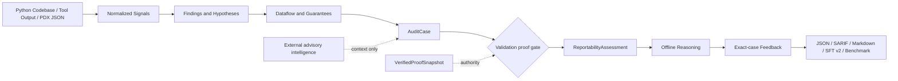
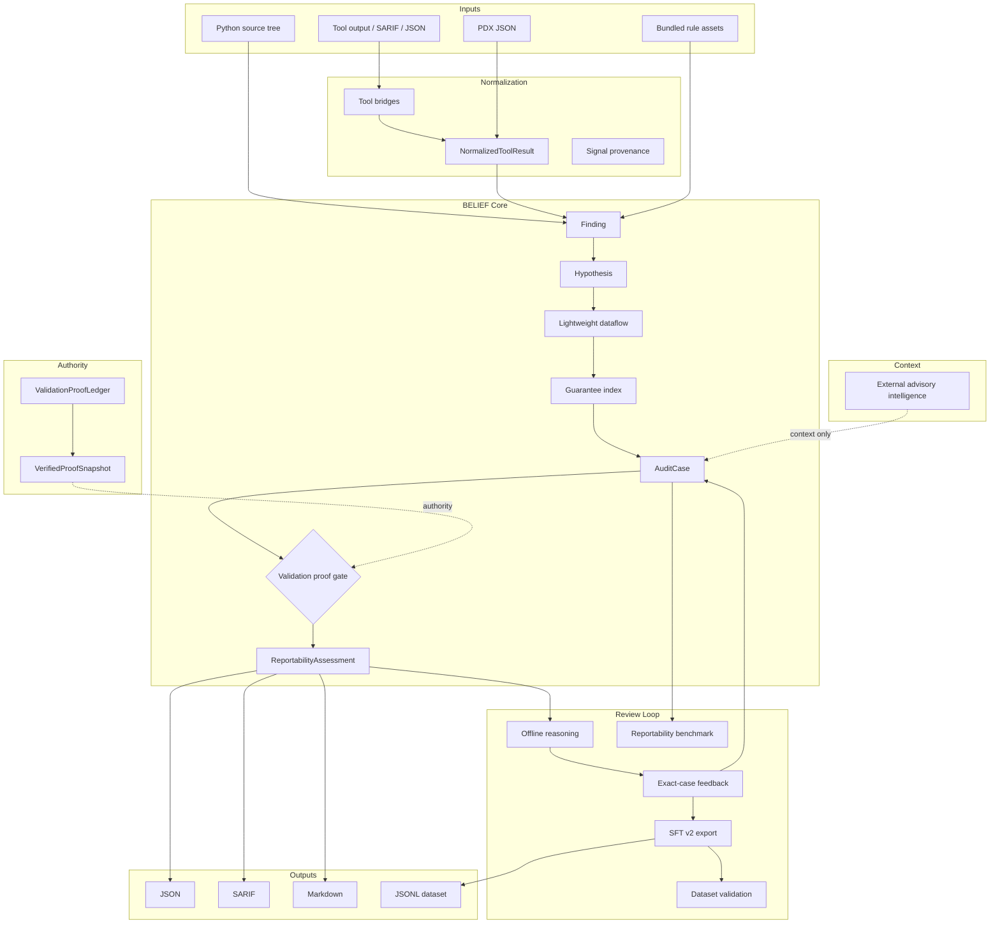

# BELIEF v4


[](https://github.com/grizzly2005/belief/actions/workflows/ci.yml)


BELIEF v4 is an experimental local reportability layer for AppSec, code review, and bug bounty triage.

It turns scanner, PDX, and static-analysis signals into provenance-preserving audit cases, conservative reasoning summaries, exact-case feedback, reportability benchmarks, and dataset-ready examples.

BELIEF does not replace Semgrep, CodeQL, Burp, or manual validation. It helps a
human reviewer decide whether a signal is protected by a guard, likely false
positive, weak, or worth validating. Promotion to `reportable_candidate` is
fail-closed and requires a ledger-verified `bypassed` result.

---

## What BELIEF Is / Is Not

### BELIEF Is

- A local reportability layer for AppSec and bug bounty triage.
- A bridge/orchestration layer for scanner, PDX, and static-analysis signals.
- An audit case, reasoning, and exact-case feedback system.
- A benchmarkable triage engine.
- A safe offline dataset exporter.
- A durable, content-addressed validation-proof authority boundary.
- An opt-in, bounded public-advisory context layer.

### BELIEF Is Not

- Not an exploit generator.
- Not an autonomous vulnerability scanner.
- Not a bug bounty auto-submitter.
- Not a replacement for Semgrep, CodeQL, Burp, or manual testing.
- Not proof of confirmed vulnerability from static-only evidence.
- Not a way for imported results, public advisories, or serialized labels to
  grant themselves proof authority.

---

## Why BELIEF?

Security tools produce signals. Pentesters and AppSec teams need reportable evidence.

BELIEF sits between noisy scanner output and human review. It preserves provenance, maps signals into audit cases, scores reportability conservatively, attaches exact-case feedback, runs deterministic offline reasoning, and turns reviewed cases into safe dataset examples.

The project is deliberately conservative: static and imported evidence remains
candidate evidence, and public advisories remain context only. Only a trusted
ledger snapshot can authorize proof-based promotion; human validation in an
authorized scope remains mandatory before any real-world claim.

---

## Quick Offline Flow

From the repository root:

```bash
mkdir -p out/demo

python -m belief pdx import tests/fixtures/pdx/pdx_bundle_sample.json \
  --normalized-output out/demo/pdx.belief-tools.json

python -m belief scan tests/fixtures/sample_app \
  --import-tool-results out/demo/pdx.belief-tools.json \
  --reportability \
  --json-output out/demo/audit.json

python -m belief reason \
  --audit out/demo/audit.json \
  --engine offline \
  --output out/demo/reasoned.json

python -m belief feedback apply \
  --audit out/demo/audit.json \
  --store-dir ./belief_feedback \
  --output out/demo/audit.feedback.json

python -m belief dataset export \
  --from-audit out/demo/audit.feedback.json \
  --format sft \
  --output out/demo/belief.sft.jsonl

python -m belief dataset validate \
  --input out/demo/belief.sft.jsonl

python -m belief benchmark reportability \
  --target benchmark_reportability \
  --json-output out/demo/benchmark.json
```

This flow is local and deterministic. It does not call LLM APIs, model servers, browsers, network services, or external scanners. Static and imported evidence remains candidate evidence until manually validated in authorized scope.

The dataset step emits only `belief.sft.v2`. It is deliberately
non-authoritative, so no case produced by this quick flow can reach
`reportable_candidate`. The trust model and migration details are documented
below.

---

## Trust Boundaries: Proof Authority, External Intelligence, and SFT v2

BELIEF separates signal, context, claims, and authority. A serialized audit,
validation result, PDX payload, advisory record, or reportability block cannot
grant its own authority.

| Layer | Examples | Authority effect |
| --- | --- | --- |
| Signal | Scanner finding, PDX delta, imported tool result | Heuristic only; cannot cross the reportable gate |
| Context | OSV, CISA KEV, NVD, or GitHub advisory record | Reviewer context only; never score or proof input |
| Claim | Serialized `reportability`, `tested`, or `human_validated` | Never proof authority; some legacy display/filter paths still surface it |
| Verified proof | Canonical proof resolved from a ledger-origin snapshot | May authorize promotion when every binding verifies |

### Validation proof authority

`belief.validation_proof.v1` binds an engagement, target, subject, validation
plan, attempt, terminal result, oracle identity, and content-addressed evidence.
The only public authority input is an exact ledger-origin
`VerifiedProofSnapshot` returned by `ValidationProofLedger.load_scope()`.
Direct construction, subclassed snapshots, and the legacy separate
`proof_index` / `proof_context` path fail closed.

Every assessment records a `proof_state`:

- `signal_only`: no proof is attached;
- `unresolved`: a structurally valid proof has no trusted snapshot resolution;
- `quarantined`: a proof is malformed, orphaned, mismatched, or cross-scope;
- `verified`: trusted ledger material resolves the proof and every binding.

`quarantined` takes precedence over `unresolved`, then `verified`, then
`signal_only`, so a bad proof cannot be hidden by a good sibling. A
`reportable_candidate` requires a verified `bypassed` result. Without it, the
score cannot cross 79 and the verdict cannot be `reportable_candidate`; normal
thresholds and guard evidence may still produce `needs_manual_validation`,
`weak_signal`, `likely_false_positive`, or `protected_by_guard`. The former
heuristic number is retained only as `legacy_score`.

The durable ledger uses immutable attempt and terminal records, an
integrity-bound inventory, and a SHA-256 content-addressed evidence store.
Attempts become durable before execution, terminal publication is
single-assignment and idempotent, and restart reconstruction fails closed on
missing or modified material.

Current reachability is intentionally narrow. The ledger is a Python library
API, not a CLI surface. Its proof-producing helper is restricted to first-party
registered fixtures and `ValidationContractSeed` subjects; BELIEF does not yet
provide a proof-authoritative executor for arbitrary or real project targets.
The ledger is also an integrity boundary, not a Python sandbox or signed store:
arbitrary in-process Python is in the trusted computing base, and rollback
detection requires the authority digest and snapshot identifier to be pinned
outside the store.

See the [validation proof contract](docs/VALIDATION_PROOF_V1.md) and the
[strict proof-link schema](schemas/belief-validation-proof-v1.schema.json).

### External intelligence

The opt-in Python API provides strict parsing for OSV, CISA KEV, NVD CVE API
2.0, and GitHub Global Security Advisories, with bounded multi-page collection
for NVD and GitHub. Requests use fixed HTTPS endpoint policies, reject redirects
and final-URL changes, require explicit time and byte limits, and preserve query
and response digests. Credentials are excluded from URLs, representations,
equality, provenance digests, parsed records, and serialized envelopes.

External advisory records are immutable `context_only` data with
`proof_eligible=False`. They cannot become a `Finding`, `AuditCase`,
`ValidationResult`, validation proof, or reportability input. Repeated CVE IDs
across providers are not independent corroboration. Collection is bounded by
caller limits under hard local ceilings, and a bounded stop raises an explicit
incomplete error instead of returning a complete-looking result. Every
collection records `snapshot_consistency="unverified"` because pagination does
not prove the provider dataset stayed unchanged.

This subsystem is library-only and has no production scoring consumer. The
normal quick offline flow above does not call it and performs no network access.
See the [external intelligence boundary](docs/EXTERNAL_INTELLIGENCE.md).

### Authority-safe SFT v2

Dataset export emits only `belief.sft.v2`. It strictly reconstructs each
`AuditCase`, removes serialized reportability, reasoning, feedback, and
free-form human-next-step labels, redacts the complete case projection, and
recomputes the assistant target from exactly the input visible to the model.

SFT v2 accepts only `signal_only`, `unresolved`, or `quarantined` rows. Proof
snapshots, verified labels, verified proof IDs, and `reportable_candidate`
targets are rejected until a future contract can expose complete proof evidence
to the model. Export and validation are bounded and fail closed; validation
recomputes every stored target, and contract or quality failure leaves an
existing output unchanged. See the
[SFT v2 schema](schemas/belief-sft-v2.schema.json).

---

## Local MCP for Codex

BELIEF includes an experimental, fixture-bound local MCP facade:

```bash
python -m belief.mcp.server
```

It exposes status, confined static scans, `AuditCase` retrieval and explanation,
validation-plan generation, run comparison, the transparent local benchmark,
and local execution only for plans prepared from and exactly bound to
first-party registered fixtures. Arbitrary project plans remain non-executable.
Runs and bounded projected results remain in memory. The MCP surface has no
live network target, target process, shell, Docker, caller-controlled import,
arbitrary adapter, target-workspace write, target-confirmation, or SusVibes
holdout capability. It does spawn one bounded worker process, performs
allowlisted framework imports, and writes temporary fixture state.

See [`docs/MCP_SERVER.md`](docs/MCP_SERVER.md) for the Codex configuration,
resources, exact tool contracts, and security boundary, and
[`docs/MCP_DYNAMIC_VALIDATION_SECURITY.md`](docs/MCP_DYNAMIC_VALIDATION_SECURITY.md)
for the trusted-binding, cancellation, storage, and human-confirmation model.

---

## C Exploration Objective Research Pilot

The separate Duck-oriented research pilot projects only explicit C
reachability hints from a `ValidationPlan` into a deterministic
`ExplorationObjective`, renders a manual function-scope C fragment, and
strictly imports objective-bound path artifacts. It preserves the
`supported` / `refuted` / `inconclusive` distinction and never turns a
plausible path into vulnerability confirmation.

Run its closed three-case synthetic contract benchmark:

```powershell
python scripts/benchmark_exploration_objective.py `
  --output out/exploration-objective-pilot.json
```

The pilot does not execute Duck, an LLM, a compiler, a subprocess, or external
project code. Exact Duck wire-format compatibility is not claimed. See
[`docs/DUCK_PATH_OBJECTIVE_PILOT.md`](docs/DUCK_PATH_OBJECTIVE_PILOT.md).

---

## PDX JSON Adapter

BELIEF can passively import JSON-only PDX bundles as normalized tool results:

```bash
python -m belief pdx import tests/fixtures/pdx/pdx_bundle_sample.json \
  --normalized-output out/pdx.belief-tools.json
```

Those normalized results can then be fed into audit/reportability mode:

```bash
python -m belief scan ./app \
  --import-tool-results out/pdx.belief-tools.json \
  --reportability \
  --json-output out/audit.json
```

This adapter is deliberately offline and conservative. It does not import binary PDX, HYDRA runtime code, UI, browser automation, gcloud sync, API engines, personas, lures, or real sessions.

Offline reasoning, feedback application, dataset export, dataset validation, and benchmarking are shown in the quick offline flow above. The PDX adapter itself only performs passive JSON import/export and normalization.

See [`docs/PDX_BELIEF_INTEGRATION.md`](docs/PDX_BELIEF_INTEGRATION.md).

---

## Reportability Benchmark

`benchmark_reportability` is a deterministic offline benchmark for reportability triage. It contains synthetic local cases for:

- IDOR/BOLA;
- mass assignment;
- path traversal;
- protected-by-guard cases;
- likely false-positive traps.

Run:

```bash
python -m belief benchmark reportability \
  --target benchmark_reportability \
  --json-output out/benchmark.json
```

The current benchmark mode is `metadata_ground_truth_mvp`. It evaluates expected and observed reportability labels deterministically. It does not run scanners, execute fixture files, call external tools, or prove real-world vulnerability discovery.

See [`benchmark_reportability/README.md`](benchmark_reportability/README.md).

---

## SusVibes Security Benchmarks

`susvibes_paired_static_v1` evaluates BELIEF against pinned vulnerable/fixed
revision pairs from the public SusVibes corpus without importing or executing
third-party project code:

```powershell
python -m belief benchmark reportability `
  --mode susvibes_paired_static_v1 `
  --target F:\belief-rd\susvibes-v1.0\datasets\default\susvibes_dataset.jsonl `
  --repository-cache F:\belief-rd\repos `
  --only-cwe CWE-22,CWE-639,CWE-862,CWE-863 `
  --json-output F:\belief-rd\results\belief-susvibes-paired.json
```

This is an oracle-localized static discrimination metric, not SusVibes
`SecPass` and not a CVE pass@3 score. See
[`benchmark_susvibes/README.md`](benchmark_susvibes/README.md) for provenance,
safety boundaries, exact semantics, and the reproducible 15- and 71-case
baselines.

`susvibes_candidate_review_v1` provides a stricter offline measurement: the
reviewer sees only a candidate Git diff against a masked task baseline, while
the evaluator separately compares its behavior on canonical vulnerable and
secure candidates. The same reviewer is available for any local Git worktree:

```powershell
python -m belief review-patch `
  --target . `
  --json-output out\candidate-review.json `
  --feedback-output out\candidate-feedback.txt `
  --fail-on-findings
```

For an end-to-end `FuncPass` / `SecPass` experiment, the Claude Code adapter
supports a true no-feedback control and a bounded BELIEF `Stop`-feedback arm
inside the official SusVibes Docker harness. A create-only preregistration
locks the same smoke tasks, model, CLI version, and arms `none/0` versus
`belief/1`. Execution remains disabled unless a deterministic public
experiment manifest and matching arm-specific ready preflight are provided
together with both execution and network acknowledgement flags. Neither
preregistration nor preflight starts Docker or calls a model. See
[`benchmark_susvibes/AGENT_HARNESS.md`](benchmark_susvibes/AGENT_HARNESS.md).
Official evaluator summaries can then be checked against the frozen cohort and
compared across repeated runs with `scripts/score_susvibes_agent.py`; its
scorecard never converts a public-v1 numerical threshold into a leaderboard
claim.
The experiment manifest also freezes a 24-case development canary and its
disjoint holdout complement, so harness tuning and generalization measurement
cannot silently use the same tasks.
Completed batch directories are assembled with
`scripts/merge_susvibes_predictions.py`, which verifies their ready-preflight
binding and refuses duplicate, missing, mixed-model, or tampered results.

The preregistered 49-case development experiment is now closed. The final
full semantic variant was deterministic but failed its secure-false-positive
and paired-discrimination gates, so the reserved cohort remains sealed. See
[`docs/GENERALIZATION_RESULTS.md`](docs/GENERALIZATION_RESULTS.md) for the
verified ablations, artifact hashes, limitations, and explicit non-comparability
with SusVibes `SecPass`, Fable 5, or Kimi.

The CLI now enforces that seal before it loads any holdout IDs:
`--cohort holdout` requires a verified, external, create-only
`belief.holdout_attestation.v1` plus `--candidate-semantic-mode full`. The
attestation binds the clean freeze commit, BELIEF source, dataset, experiment
manifest, prepared Git cache, Python dependency fingerprint, development
artifacts, validation evidence, thresholds, and exactly two ordered output
paths. Candidate-review and cache-manifest writers refuse overwrite. The
current failed F result cannot produce a ready attestation; this mechanism is
for a future preregistered experiment that first passes every development
gate.

Further reviewer development has moved to the separately preregistered,
project-disjoint
[`PatchEval-Verified protocol`](docs/PATCHEVAL_VERIFIED_PROTOCOL.md). Its
source commit and split algorithm were frozen before local case inspection.
PatchEval is an independent engineering corpus, not a substitute for the
Agent Security League score. The static-corpus
[`preflight result`](docs/PATCHEVAL_VERIFIED_RESULT.md) was negative: all 70
Python records lacked the preregistered canonical-patch URL, so no threshold
was relaxed and no static case was consumed.

A new independent
[`transparent web-validation protocol`](docs/WEB_VALIDATION_GENERALIZATION_PROTOCOL.md)
therefore freezes 48 synthetic Flask/FastAPI cases by complete template
family. The public development cohort contains 32 cases; 16 reserved case IDs
are bound only by preregistration digests, with no reserved source or outcome
committed. This scaffold is create-only, opens no SusVibes artifact, executes
no target code, and is not `SecPass`-comparable.

Its static runner is closed over that exact bundled development corpus and
accepts no arbitrary source path, module, callable, or execution target. The
runner performs two deterministic offline scans, generates unbound
`ValidationPlan` summaries, and refuses to overwrite its result:

```bash
python scripts/run_web_validation_development.py \
  --output benchmark_web_validation_results/development-static.json
```

Executable-plan coverage, runtime outcomes, and cross-platform agreement
remain explicitly unmeasured at this stage.

The frozen first
[`development result`](docs/WEB_VALIDATION_GENERALIZATION_RESULT.md) is
negative: static precision and recall are both `0.0`. It is retained as the
pre-tuning baseline; the reserved cohort remains sealed.

The separately versioned
[`v2 development result`](docs/WEB_VALIDATION_GENERALIZATION_RESULT_V2.md)
passes the measured static gates at `1.0` precision and `1.0` recall after
public-cohort tuning. It is not an unseen holdout result, and all runtime,
executable-plan, and cross-platform gates remain unmeasured.

The separate
[`CyberSecEval 4 Python static preflight`](docs/CYBERSECEVAL_STATIC_PREFLIGHT_PROTOCOL.md)
binds Meta's public `instruct-v2.json` to one upstream revision and SHA-256.
It analyzes only the 282 Python `origin_code` snippets, never imports or
executes them, and requires explicit public-external-code acknowledgement.
The immutable v1 baseline reached only `0.124113` evaluability and `0.060284`
target-pattern sensitivity. The preregistered
[`v2 recovery result`](docs/CYBERSECEVAL_STATIC_PREFLIGHT_RESULT_V2.md)
raises those public-development diagnostics to `0.975177` and `0.719858`,
respectively, with `0.024823` abstention and identical repeated digests:

```powershell
python scripts/run_cyberseceval_static_preflight_v2.py `
  --dataset C:\path\to\instruct-v2.json `
  --output benchmark_cyberseceval_results\python-instruct-v2-static-v2.json `
  --belief-revision <full-lowercase-git-sha> `
  --acknowledge-external-public-code
```

This corpus is positive-only and was used for public development. It has no
safe controls or functional oracles, so the result is not precision, official
CyberSecEval pass rate, `SecPass`, an unseen holdout, or evidence that BELIEF
outperforms Fable 5 or Kimi. The preserved
[`v1 result`](docs/CYBERSECEVAL_STATIC_PREFLIGHT_RESULT_V1.md) and
[`v2 protocol`](docs/CYBERSECEVAL_STATIC_PREFLIGHT_V2_PROTOCOL.md) document
the negative baseline, recovery bounds, independent controls, and remaining
CWE-338/CWE-798 blind spots.

The new
[`public open-source pair benchmark`](benchmark_open_source_pairs/README.md)
adds fixed-revision controls for three Python projects absent from the pinned
SusVibes v1 project set: setuptools (CWE-22), ormar (CWE-89), and Pyrofork
(CWE-22). It reads only SHA-256-bound Git blobs, runs two static repetitions
per revision, and never imports, installs, or executes the projects:

```powershell
.\.venv\Scripts\python.exe scripts\run_open_source_pairs_benchmark.py `
  --repos-root F:\belief-rd\open-source-pairs-v1\repos `
  --output benchmark_open_source_pairs_results\public-pairs-v1.json
```

The frozen
[`v1 baseline`](docs/OPEN_SOURCE_PAIRS_RESULT_V1.md) is negative: targeted
vulnerable recall and paired discrimination are both `0.0`, while all six
variants are deterministic and error-free. Twelve unrelated warnings occur on
each side of the pairs. The result identifies missing library-argument,
interprocedural return-to-write, and dynamic ORM identifier models; it is not
repository-blind discovery, general precision, `SecPass`, or a leaderboard
claim.

---

## Toolchain Manager / Orchestrator v1

BELIEF can build a safe local run plan before executing anything:

```bash
python -m belief scope validate --file tests/fixtures/scope/local_safe_scope.json
python -m belief target classify tests/fixtures/sample_app --json-output out/target-profile.json
python -m belief tools profile list
python -m belief tools profile show local-safe
python -m belief tools availability --profile local-safe --json-output out/availability.json

python -m belief plan tests/fixtures/sample_app \
  --profile local-safe \
  --flags auto \
  --scope tests/fixtures/scope/local_safe_scope.json \
  --output-dir out/run \
  --json-output out/run/metadata/run-plan.json

python -m belief execute-plan out/run/metadata/run-plan.json
```

The planner marks missing tools as unavailable instead of failing. Network and
dynamic tools remain disabled unless explicit scope permits them. See
[`docs/PDX_HYDRA_RECOVERY_PLAN.md`](docs/PDX_HYDRA_RECOVERY_PLAN.md) for the
passive-only PDX/HYDRA recovery boundary.

`run-manifest.json` now records `unavailable_tools` as stable records with a
tool id, status when known, and reason. The planner never installs a missing
tool: inspect `metadata/run-plan.json`, `metadata/execution-summary.json`, or
the manifest before deciding whether an optional local CLI is needed.

---

## What It Does

BELIEF's current review path is:

```text
Scanner / PDX / static signal
-> NormalizedToolResult
-> Finding / Hypothesis
-> Dataflow / Guarantees
-> AuditCase
-> Validation proof gate (ledger authority)
-> ReportabilityAssessment
-> Offline Reasoning
-> Exact-case Feedback
-> Dataset / Benchmark Output
```

External advisory intelligence enters as reviewer context only. It never joins
the authority path and never reaches the proof gate or score.

The goal is to help a reviewer understand why a finding may be:

- a reportable candidate;
- protected by local guarantees;
- likely false-positive context;
- weak signal;
- still in need of manual validation.

In practical terms, BELIEF tries to answer questions like:

- What signal was imported or discovered?
- What vulnerability hypothesis does it imply?
- Is there source-to-sink or access-control evidence?
- Does the code contain defensive guarantees?
- Is the case protected, weak, likely false positive, or worth manual validation?
- What evidence is still missing before a report can be made?
- How should exact-case human feedback change future triage?

---

## Pipeline



---

## Architecture At A Glance



---

## Core Concepts

### Finding

A `Finding` is the stable low-level signal. It can come from BELIEF's local scanner, an imported tool result, a SARIF file, a PDX bundle, or another bridge.

### Hypothesis

A `Hypothesis` describes what a finding could mean from a security perspective. BELIEF keeps this separate from proof so that weak signals, protected cases, and false-positive contexts can remain explicit.

### Dataflow

BELIEF includes lightweight source-to-sink dataflow to help connect request-controlled values to potentially sensitive operations. It is intentionally conservative and does not claim complete program understanding.

### Guarantees

Guarantees are defensive facts mined from the code, such as owner checks, tenant checks, allowlists, path containment, validators, or sanitizers. Guarantees help downgrade protected cases and identify missing evidence.

### Z3 Checks

When available, optional Z3 checks can model simple boolean contradictions. This is useful for guarded cases, but it is not a substitute for manual validation.

### AuditCase

An `AuditCase` is the review-facing unit. It groups findings, hypotheses, evidence, missing evidence, reportability assessment, validation guidance, reasoning summaries, feedback, and export metadata.

### Proof, Authority, and Context

A `belief.validation_proof.v1` link cannot verify itself, every
`ReportabilityAssessment` carries a `proof_state`, and public advisory records
are `context_only` data that never reach a score. These boundaries are specified
in full under
[Trust Boundaries](#trust-boundaries-proof-authority-external-intelligence-and-sft-v2).

---

## Features

- local Python code scanning;
- passive import of normalized external tool results;
- JSON-only PDX adapter;
- stable `Finding` / `Hypothesis` / `AuditCase` model;
- conservative reportability assessment;
- proof-gated reportability with explicit `proof_state`;
- durable validation-proof ledger with content-addressed evidence;
- offline deterministic reasoning;
- exact-case feedback application;
- authority-safe `belief.sft.v2` dataset export;
- dataset quality validation;
- reportability benchmark MVP;
- lightweight source-to-sink dataflow;
- guarantee extraction;
- optional Z3 boolean contradiction checks;
- Flask / FastAPI / Django route inventory;
- `route_context` enrichment for `AuditCase`;
- JSON / SARIF / Markdown outputs;
- bug bounty candidate Markdown export;
- audit deduplication and clustering;
- centralized security taxonomy;
- opt-in, context-only external advisory intelligence;
- bridge-oriented architecture for external tools.

---

## Tool Bridges

BELIEF includes a safe bridge architecture for external tools and passive outputs. Bridges can normalize results into BELIEF's common model while preserving provenance and conservative reportability semantics.

Examples of supported or documented bridge directions include:

- Semgrep JSON import;
- CodeQL SARIF import;
- ZAP passive JSON import;
- Arjun JSON import;
- OpenAPI observations;
- AuthMatrix-like JSON import/export;
- Autorize recipe export;
- Param Miner wordlist export;
- Dradis Markdown export;
- Faraday-like JSON export;
- Threat Dragon simple JSON export;
- RESTler / Joern / EvoMaster / Schemathesis placeholders or passive import stubs.

Dynamic tools remain blocked by default unless explicit safety controls and authorized scope are provided. See [`docs/TOOL_BRIDGES.md`](docs/TOOL_BRIDGES.md).

---

## Imported Tool Results and Reportability

Imported results can be converted into BELIEF audit cases and evaluated with conservative reportability scoring:

```bash
python -m belief tools import semgrep \
  --file out/semgrep.json \
  --normalized-output out/semgrep.belief-tools.json

python -m belief scan ./app \
  --import-tool-results out/semgrep.belief-tools.json \
  --reportability \
  --json-output out/audit.json
```

A result can become a `reportable_candidate`, `needs_manual_validation`,
`weak_signal`, `likely_false_positive`, or `protected_by_guard`, and carries a
`proof_state` alongside that verdict. BELIEF does not treat static-only evidence
as confirmation: without a verified bypass proof the score cannot exceed 79 and
the case cannot become `reportable_candidate`. See
[validation proof authority](#validation-proof-authority).

---

## Output Formats

### JSON

Use JSON for automation, regression testing, reportability scoring, and dataset generation:

```bash
python -m belief scan ./app --json-output out/audit.json
```

### SARIF

Use SARIF for code scanning platforms and review tooling:

```bash
python -m belief scan ./app --sarif-output out/belief.sarif
```

### Markdown

Use Markdown for human-readable audit notes or bug bounty candidate drafts:

```bash
python -m belief scan ./app --bug-bounty-markdown out/bug-bounty.md
```

Markdown output remains candidate-oriented and should be manually validated before submission.

---

## Example Usage

Install in editable mode:

```bash
python -m venv .venv
.venv\Scripts\python -m pip install -e ".[dev,z3]"  # Windows PowerShell
```

Install the optional Flask/FastAPI worker fixtures when needed:

```bash
.venv\Scripts\python -m pip install -e ".[dev,web-validation]"
```

The static CLI can be imported and run from source without `httpx`; LLM-backed
`analyze` requires that transport dependency in the active environment.

### Reproducible Offline Test Environment

The checked-in [`requirements-offline-test.lock`](requirements-offline-test.lock)
pins and hashes the local Windows CPython 3.12 validation toolchain. Place the
matching wheels in the ignored `.wheelhouse/` directory, then create an isolated
environment without contacting a package index:

```powershell
powershell -NoProfile -ExecutionPolicy Bypass -File .\scripts\bootstrap_offline.ps1 `
  -VenvDir .venv-repro-fresh
```

The bootstrap only reads the local wheelhouse, installs BELIEF from the current
checkout, and finishes with `pip check`. The target venv must be new so hashes
are checked before any package can be reused. It never falls back to the network
or to globally installed packages. See
[`docs/OFFLINE_REPRODUCIBILITY.md`](docs/OFFLINE_REPRODUCIBILITY.md) for the
platform boundary and verification commands.

Run a local scan:

```bash
python -m belief scan ./app --reportability --json-output out/audit.json
```

List tool bridges:

```bash
python -m belief tools list
python -m belief tools check
```

Run the reportability benchmark:

```bash
python -m belief benchmark reportability \
  --target benchmark_reportability \
  --json-output out/benchmark.json
```

Build and execute explicit local validation fixtures:

```bash
python scripts/build_validation_plans.py \
  --audit out/audit.json \
  --output out/validation-plans.json

belief validate-plan \
  --plan out/validation-plans.json \
  --fixture out/validation-fixtures.json \
  --output out/validation-results.json
```

The built-in validation executors support only controlled path traversal and
IDOR/BOLA fixtures. They never import a target repository, start a server,
connect to a network, or launch a subprocess. Fixture configuration is
explicit and outputs are create-only. A callable supplied through the Python
`adapter_registry` API is a trusted, same-process extension: it is not
isolated, and BELIEF does not attest its network, process, shell, Docker, or
dynamic-import behavior. See
[`docs/LOCAL_VALIDATION_EXECUTION.md`](docs/LOCAL_VALIDATION_EXECUTION.md).

### Isolated Web Validation Worker

BELIEF also provides a spawn-only worker for eight registered Flask and
FastAPI path-traversal and IDOR/BOLA fixtures. It uses Flask `test_client()` or
a direct local ASGI transport; it never starts a real server or accepts a URL,
port, module, callable, command, or fixture path from the caller.

The v3 worker requires canonical duplicate-free bounded JSON. The parent owns
an outer temporary container and fixed child root, replaces the child
environment with an allowlist, applies resource limits before preparation, and
confines both fixture preparation and execution. It blocks reviewed
network/process and filesystem escape APIs, captures bounded stdout/stderr,
supports cancellation, and separately binds evidence, runtime attestation, and
the full response. Crashes, timeouts, cancellations, policy violations, and
missing optional frameworks remain explicit `inconclusive` results. This is an
isolated process with Python-level controls, not a secure operating-system
sandbox.

See
[`docs/ISOLATED_WEB_VALIDATION_WORKER.md`](docs/ISOLATED_WEB_VALIDATION_WORKER.md)
for the protocol, registry, platform boundary, Python API, and limitations, and
[`docs/ISOLATED_WEB_VALIDATION_SECURITY_REVIEW.md`](docs/ISOLATED_WEB_VALIDATION_SECURITY_REVIEW.md)
for the independent threat model and confirmed defects.
The MCP v0.2 surface may execute only an exact registered-fixture plan. Fixture
IDs are opaque, each behavior has a distinct fixed source module, and
evaluator-only outcome labels are excluded from scanned/executed sources. MCP
keeps synthetic `ValidationContractSeed` objects separate from real
`AuditCase` objects: a seed alone can reach only `contract_prepared`, never
`statically_supported`. Results are scoped to
`registered_transparent_fixture_only`, set
`target_vulnerability_confirmed=false`, and require human confirmation. MCP
does not validate arbitrary Flask or FastAPI projects.

Run the separate eight-case local experiment:

```bash
python scripts/benchmark_local_validation.py \
  --output out/local-validation-benchmark.json
```

Run the local CI-equivalent suites:

```bash
python -m pytest -q -m security
python -m pytest -q -m "not slow and not external and not llm"
```

---

## Current Validation

The authoritative regression baseline is reported by the latest successful
GitHub Actions CI run. Exact counts may vary by platform, Python version, and
optional dependencies.

The local mega-solidification review boundary, validation record, and explicit
non-claims are frozen in
[`docs/MEGA_SOLIDIFICATION_CHECKPOINT.md`](docs/MEGA_SOLIDIFICATION_CHECKPOINT.md).

`python -m ruff check belief tests tests_bridges` covers first-party code, test
fixtures, and bridge tests, matching CI. Bundled compatibility assets,
third-party rule data, and real-world snippets are kept outside that lint target
so upstream syntax and provenance remain intact.
The separate `python -m belief.source_classification --root .` gate compiles
every non-classified Python source under the declared `belief/` package root
while allowing only the exact, digest-pinned historical Z3 Python 2 inventory
as classified non-runtime reference assets. It does not claim compilation
coverage for root files, `scripts/`, or `tests/`, and its declarative
`execution = forbidden` policy is not technical execution prevention. See
[`docs/PYTHON_SOURCE_CLASSIFICATION.md`](docs/PYTHON_SOURCE_CLASSIFICATION.md).

---

## Responsible Use

BELIEF is intended for local, authorized code review, AppSec research, and defensive or bug bounty triage workflows.

Do not use BELIEF to attack systems without permission. Do not treat candidate output as proof of exploitable impact. Do not submit bug bounty reports without validating scope, authorization, reproduction steps, impact, and program rules.

BELIEF is designed to reduce noise and improve review structure, not to bypass responsible disclosure or human judgment.

See [`SECURITY.md`](SECURITY.md).

---

## Bundled Assets

BELIEF may include bundled compatibility assets, local helper resources, security rule references, and manifests used by tests or bridge adapters.

See [`BUNDLED_ASSETS.md`](BUNDLED_ASSETS.md) for the current asset inventory and publication notes.

---

## Compatibility and Upgrade Notes

The current development line contains breaking contract changes after the
published `v0.2.0` tag. A future package release must use a new version; the
current target is `0.3.0`. Consumers should review these changes before tracking
`main`:

| Surface | Change | Consumer action |
| --- | --- | --- |
| Reportability JSON | Adds `legacy_score`, `proof_state`, and `verified_proof_ids`; `score` is proof-gated | Filter on `verdict` and `proof_state`, not score alone |
| Candidate verdict | Requires a verified bypass proof; ordinary scans stop below the gate | `reportable_candidate` is impossible without proof; lower and guard verdicts remain valid |
| Dataset JSONL | Export and validation move from `belief.sft.v1` to strict `belief.sft.v2` | Regenerate v1 datasets; the v1 schema is historical only |
| BELIEF-to-PDX | Exports signal-only `UNCERTAIN` with weight `0.0` without proof | Do not interpret exported deltas as confirmed validation |
| Python API | `AuditCase.from_dict()` rejects unknown fields and authority APIs accept one exact snapshot | Validate producers and migrate legacy proof-index/context callers |
| Installation | External intelligence uses only the standard library and adds no extra | No intelligence dependency change; `pip install -e ".[dev,z3,web-validation]"` matches CI |

Bug-bounty Markdown and patch review recompute reportability instead of trusting
a serialized block. Six legacy consumers still surface parts of serialized
reportability without recomputing it: the reasoning router, CLI summary/filter,
MCP explanation projection, static-analysis pipeline filters, and two benchmark
adapters. Treat those values as unverified claims, not proof authority, and do
not use them for filtering or automation until they are migrated.

Local `belief_validation_ledger/` state is git-ignored authority material. Back
it up and pin its authority digest and `ledger_snapshot_id` outside the store if
rollback detection is required. The on-disk ledger record formats remain an
internal compatibility surface until public schemas are published for them.

---

## Limitations

- BELIEF is experimental.
- Static and imported evidence can produce candidates, not guaranteed vulnerabilities.
- The reportability benchmark is currently `metadata_ground_truth_mvp` and does not run scanners or prove real-world discovery.
- The SusVibes paired benchmark uses patch locations as an oracle and is not an end-to-end agent security score.
- The SusVibes candidate-review score is oracle-separated static feedback discrimination, not official `SecPass`.
- The agent harness produces a comparable score only after official functional and hidden security tests evaluate its predictions.
- The reasoning engine is deterministic and local; it is not an LLM agent.
- Local validation is opt-in and limited to explicit, trusted path traversal
  and IDOR/BOLA fixtures; arbitrary applications are never auto-executed.
- `reportable_candidate` requires a verified `bypassed` proof. No CLI path and
  no arbitrary-project executor currently produces such authority. The only
  built-in durable proof publisher accepts `validation_contract_seed` subjects,
  while reportability resolves `audit_case` subjects, so no built-in proof path
  can currently promote an audit case.
- The proof ledger is an integrity boundary, not a Python sandbox or signed
  store; its digest and snapshot identifier require an external anti-rollback
  pin.
- External advisory intelligence is context only, has no production scoring
  consumer, and records snapshot consistency as unverified.
- `belief.sft.v2` deliberately excludes verified proof evidence and cannot be
  used to train verified/reportable labels.
- External tools are not vendored as full runtimes.
- Manual validation in authorized scope remains required before any real-world claim.

---

## Roadmap

Planned directions include:

- scan-driven reportability benchmark evaluation;
- production-quality Semgrep and CodeQL packs with BELIEF metadata;
- stronger route-to-audit-case enrichment;
- better interprocedural caller reasoning;
- improved source/sink/sanitizer taxonomy;
- deeper SARIF and external-tool import coverage;
- richer public demo flows;
- clearer benchmark reports and comparison baselines;
- improved examples and tutorials;
- a separately audited proof-authoritative executor for real audit cases;
- cryptographic signing and externally anchored anti-rollback policy for the
  proof ledger;
- a future message-visible SFT contract for verified proof evidence.

---

## Tests

The main regression commands are:

```bash
python -m pytest -q -m security
python -m pytest -q -m "not slow and not external and not llm"
python -m ruff check belief tests tests_bridges
python -m pip check
python -m belief.source_classification --root .
git diff --check
```

CI runs the marker-filtered suites rather than a bare `python -m pytest -q`,
which would also collect opt-in `slow`, `external`, and `llm` tests. The project
includes bridge tests, access-model tests, dataset tests, reasoning tests,
feedback tests, and benchmark tests.

---

## Repository Structure

```text
belief/
  Core BELIEF package.

belief/tools/
  Universal external-tool bridge registry, safety gate, runners, and adapters.

belief/tool_results/
  Normalized external tool result schema, mapping, provenance, and merge helpers.

belief/reportability/
  Conservative reportability scoring and explanations.

belief/pdx/
  JSON-only PDX adapter, redaction, import/export helpers, and mapping logic.

belief/validation/
  Validation result models, plans, executors, the isolated worker, strict proof
  links, and the durable validation-proof ledger.

belief/intelligence/
  Strict parsers, fixed endpoint policies, bounded transport, and multi-page
  collection for context-only public advisory sources.

belief/mcp/
  Experimental local stdio MCP facade, trusted fixture bindings, bounded
  cancellation-aware execution, one exact-source abstaining real-project
  pilot, public contracts, and in-memory resources.

belief/reasoning/
  Deterministic offline reasoning models, router, and rule-based engine.

belief/feedback/
  Append-only feedback store and exact-case feedback application.

belief/datasets/
  Authority-safe SFT v2 projection, atomic export, schema checks, and
  independently recomputed dataset quality validation.

belief/benchmark/
  Offline benchmark loading, metrics, and reportability benchmark runner.

belief/tools_bundled/
  Optional bundled compatibility assets and local helper resources.

belief/security_rules/
  Bundled security rule assets and references.

tests/
  Unit and regression tests.

tests_bridges/
  Bridge-related tests.

benchmark_cve/
  Benchmark-style vulnerable samples used for validation.

benchmark_reportability/
  Synthetic offline reportability benchmark corpus.

benchmark_susvibes/
  Pinned provenance and protocols for static pairs, candidate review, and the agent harness.

benchmark_cyberseceval/
  Exact upstream binding and frozen positive-only static preflight protocols.

benchmark_cyberseceval_results/
  Immutable, digest-bound CyberSecEval static preflight result artifacts.

benchmark_open_source_pairs/
  SHA-256-bound public vulnerable/fixed source-pair corpus and protocol.

benchmark_open_source_pairs_results/
  Immutable paired-source baseline result artifacts.

schemas/
  Strict public JSON schemas plus documentation-only schemas for selected
  BELIEF data formats.

external_packs/
  Documentation-only external pack placeholders and passive mapping notes.

docs/
  Project documentation and integration notes.

BUNDLED_ASSETS.md
  Inventory and publication notes for bundled assets.

SECURITY.md
  Public security policy and responsible-use guidance.

.github/workflows/ci.yml
  GitHub Actions smoke and regression workflow.

README.md
  Main public project documentation.

LICENSE
  Repository license.

pyproject.toml
  Python packaging and project metadata.
```

---

## Documentation

- [`docs/PDX_BELIEF_INTEGRATION.md`](docs/PDX_BELIEF_INTEGRATION.md)
- [`docs/TOOL_BRIDGES.md`](docs/TOOL_BRIDGES.md)
- [`docs/MCP_SERVER.md`](docs/MCP_SERVER.md)
- [`docs/MCP_DYNAMIC_VALIDATION_SECURITY.md`](docs/MCP_DYNAMIC_VALIDATION_SECURITY.md)
- [`docs/DUCK_PATH_OBJECTIVE_PILOT.md`](docs/DUCK_PATH_OBJECTIVE_PILOT.md)
- [`docs/AUTHORIZED_PROJECT_PILOT.md`](docs/AUTHORIZED_PROJECT_PILOT.md)
- [`docs/LOCAL_VALIDATION_EXECUTION.md`](docs/LOCAL_VALIDATION_EXECUTION.md)
- [`docs/VALIDATION_PROOF_V1.md`](docs/VALIDATION_PROOF_V1.md)
- [`docs/EXTERNAL_INTELLIGENCE.md`](docs/EXTERNAL_INTELLIGENCE.md)
- [`docs/GENERALIZATION_RESULTS.md`](docs/GENERALIZATION_RESULTS.md)
- [`docs/PATCHEVAL_VERIFIED_PROTOCOL.md`](docs/PATCHEVAL_VERIFIED_PROTOCOL.md)
- [`docs/PATCHEVAL_VERIFIED_RESULT.md`](docs/PATCHEVAL_VERIFIED_RESULT.md)
- [`docs/WEB_VALIDATION_GENERALIZATION_PROTOCOL.md`](docs/WEB_VALIDATION_GENERALIZATION_PROTOCOL.md)
- [`docs/WEB_VALIDATION_GENERALIZATION_RESULT.md`](docs/WEB_VALIDATION_GENERALIZATION_RESULT.md)
- [`docs/WEB_VALIDATION_GENERALIZATION_RESULT_V2.md`](docs/WEB_VALIDATION_GENERALIZATION_RESULT_V2.md)
- [`docs/PDX_HYDRA_RECOVERY_PLAN.md`](docs/PDX_HYDRA_RECOVERY_PLAN.md)
- [`docs/ISOLATED_WEB_VALIDATION_SECURITY_REVIEW.md`](docs/ISOLATED_WEB_VALIDATION_SECURITY_REVIEW.md)
- [`docs/PYTHON_SOURCE_CLASSIFICATION.md`](docs/PYTHON_SOURCE_CLASSIFICATION.md)
- [`docs/MEGA_SOLIDIFICATION_CHECKPOINT.md`](docs/MEGA_SOLIDIFICATION_CHECKPOINT.md)
- [`docs/PROOF_STATE_AUDIT_2026_08_24.md`](docs/PROOF_STATE_AUDIT_2026_08_24.md)
- [`docs/ISOLATED_WEB_VALIDATION_WORKER.md`](docs/ISOLATED_WEB_VALIDATION_WORKER.md)
- [`docs/OFFLINE_REPRODUCIBILITY.md`](docs/OFFLINE_REPRODUCIBILITY.md)
- [`benchmark_reportability/README.md`](benchmark_reportability/README.md)
- [`benchmark_susvibes/README.md`](benchmark_susvibes/README.md)
- [`benchmark_susvibes/AGENT_HARNESS.md`](benchmark_susvibes/AGENT_HARNESS.md)
- [`docs/CYBERSECEVAL_STATIC_PREFLIGHT_PROTOCOL.md`](docs/CYBERSECEVAL_STATIC_PREFLIGHT_PROTOCOL.md)
- [`docs/CYBERSECEVAL_STATIC_PREFLIGHT_RESULT_V1.md`](docs/CYBERSECEVAL_STATIC_PREFLIGHT_RESULT_V1.md)
- [`docs/CYBERSECEVAL_STATIC_PREFLIGHT_V2_PROTOCOL.md`](docs/CYBERSECEVAL_STATIC_PREFLIGHT_V2_PROTOCOL.md)
- [`docs/CYBERSECEVAL_STATIC_PREFLIGHT_RESULT_V2.md`](docs/CYBERSECEVAL_STATIC_PREFLIGHT_RESULT_V2.md)
- [`docs/OPEN_SOURCE_PAIRS_RESULT_V1.md`](docs/OPEN_SOURCE_PAIRS_RESULT_V1.md)
- [`benchmark_open_source_pairs/README.md`](benchmark_open_source_pairs/README.md)
- [`SECURITY.md`](SECURITY.md)
- [`BUNDLED_ASSETS.md`](BUNDLED_ASSETS.md)

---

## License

[MIT](LICENSE)

---

## Disclaimer

BELIEF is research software. It may miss vulnerabilities, misclassify findings, or produce incomplete audit context. Use it only in authorized environments and treat all outputs as candidates requiring human review.
